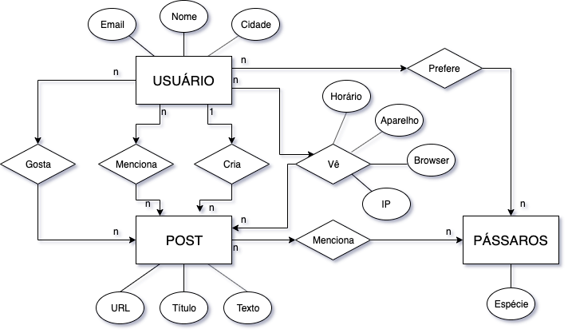
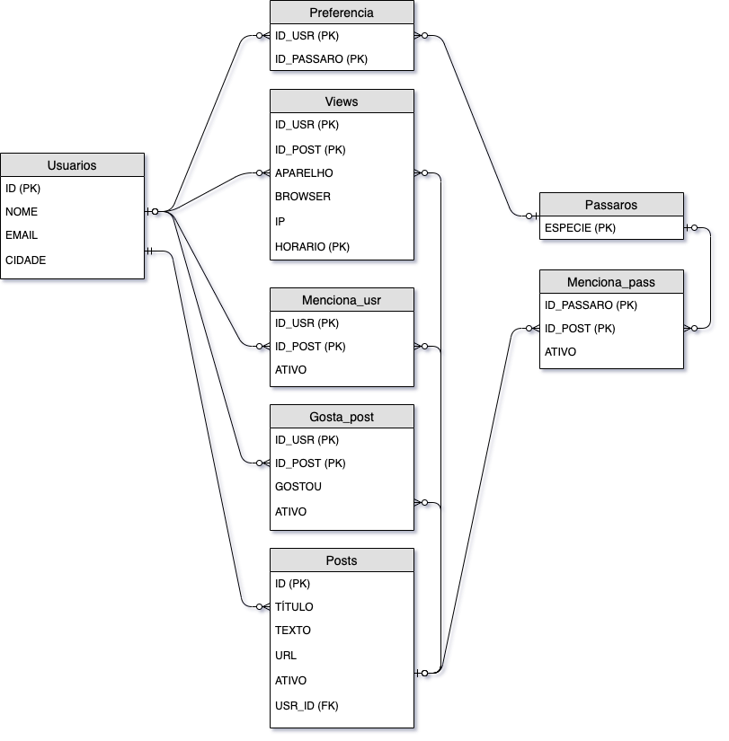

# Projeto 1 MegaDados
### Gabriel Monteiro e Rafael Vieira

## Usabilidade:

- Para criar a base de dados, rode cria_base.sql primeiro e depois script_delta.sql;
- Para testar as funcionalidades da base de dados, rode test_requests.py (test_databse.py está desatualizado, pois era a base de testes usada na primeira entrega apenas);
- Para rodar o servidor local, execute o comando no terminal no mesmo diretório do projeto: ``` uvicorn list_requests:app --reload ```

## Modelos: 

Modelo entidade relacionamento:


Modelo relacional:


### Feature extra escolhida: 
Ter uma função que lista as preferências de pássaro do usuário

## Dicionário de dados:

### Tabelas:

#### Usuários:
 - Id INT, AUTO INCREMENT (PK) - É um valor inteiro que identifica cada usuário
 - Nome VARCHAR(50) - Nome do usuário
 - Email VARCHAR(80) - Endereço de email do usuário
 - Cidade VARCHAR(50) - Endereço físico do usuário

#### Posts:
 - Id INT, AUTO INCREMENT (PK) - É um valor inteiro que identifica cada post
 - User Id INT (FK) - É o id do usuário que fez o post
 - Título VARCHAR(50), NOT NULL - Título do post, que não pode ser vazio
 - Texto VARCHAR(300) - Texto do post, com no máximo 300 charactéres
 - Imagem VARCHAR(100) - Endereço url de uma imagem associada ao post
 - Ativo BOOLEAN - Indica se o post está ativo ou não (Desativado = 0; Ativado = 1)

#### Pássaros:
 - Espécie VARCHAR(50) (PK) - É o nome da espécie de pássaro que identifica ela

#### Preferência:
 - User Id INT (PK, FK) - É um valor inteiro que identifica a preferência do usuário por seu pássaro favorito
 - Pássaro Id INT (PK, FK) - É um valor inteiro que identifica o pássaro preferido do usuário em questão

#### Menciona Pássaros:
 - Post Id INT (PK, FK) - É um valor inteiro que identifica o post que possui uma marcação de algum pássaro 
 - Pássaro Id INT (PK, FK) - É um valor inteiro que identifica o pássaro que foi mencionado no post em questão
 - Ativo BOOLEAN - Indica se o post em questão está ativo ou não (Desativado = 0; Ativado = 1)

#### Menciona Usuário:
 - Post Id INT (PK, FK) - É um valor inteiro que identifica o post que possui um shout de algum usuário
 - User Id INT (PK, FK) - É um valor inteiro que identifica o usuário que foi mencionado no post em questão
 - Ativo BOOLEAN - Indica se o post em questão está ativo ou não (Desativado = 0; Ativado = 1)
 
#### Views:
 - User Id INT (PK, FK) - É um valor inteiro que identifica o usuário que visualizou o post em questão
 - Post Id INT (PK, FK) - É um valor inteiro que identifica o post que foi visualizado
 - Aparelho VARCHAR(20) - Indica em qual aparelho o post foi visualizado
 - Browser VARCHAR(20) - Indica em qual browser o post foi acessado
 - IP VARCHAR(50) - Indica qual o IP que visualizou o post
 - Horário DATETIME (PK) - Indica o horário de visualização do post

#### Gosta Post:
 - Post Id INT (PK, FK) - É um valor inteiro que identifica o post que o usuário deu like
 - User Id INT (PK, FK) - É um valor inteiro que identifica o usuário que deu like no post
 - Gostou BOOLEAN - Indica se o usuário deu like ou deslike no post (Like = 1; Deslike = 0)
 - Ativo BOOLEAN - Indica se o post está ativo. Começa setado em 0 para todos os usuários quando um post é criado.Quando o usuário da like ou deslike no post, ativo é setado para 1. Caso o usuário delete esse like ou deslike, ativo é setado para 0 novamente. (Desativado = 0; Ativado = 1)

